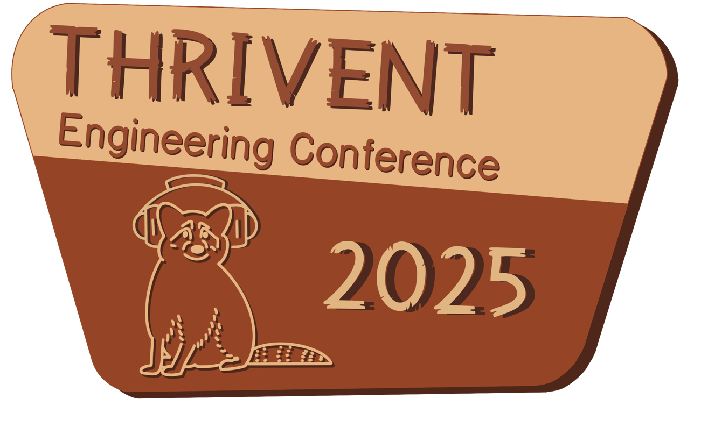
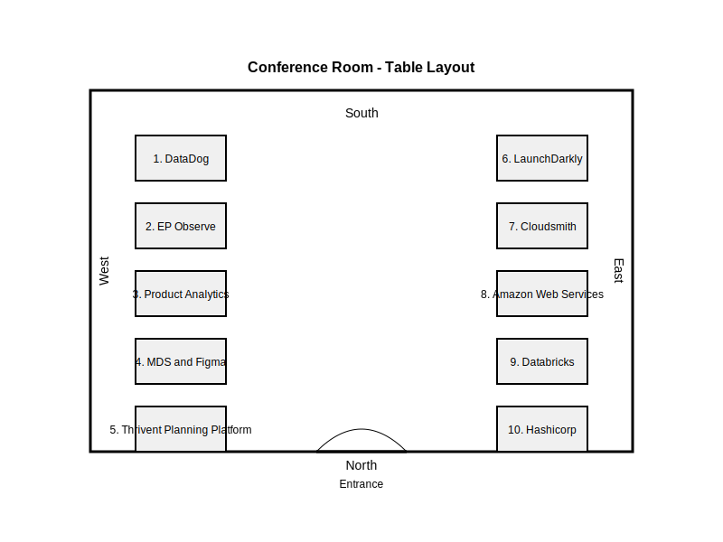

# Wednesday, June 25th 2025

<table>
    <tr>
        <td width="150px">8:00 - 9:00 am</td>
        <td width="750px" align="center" colspan="5">Breakfast (C2)</td>
    </tr>
    <tr>
        <td width="150px">9:00 - 9:05 am</td>
        <td width="750px" align="center" colspan="5">Opening remarks</td>
    </tr>
    <tr>
        <td width="150px">9:05 - 9:25 am</td>
        <td width="750px" align="center" colspan="5">Jason Walker Out Run the Bear: A Look At The Last 80 (or so) Years of DevEx</td>
    </tr>
    <tr>
        <td width="150px">9:25 - 9:45 am</td>
        <td width="750px" align="center" colspan="5">Alison Sickelka, VP of Product - Cloudsmith</td>
    </tr>
    <tr>
        <td width="150px">9:45 - 10:05 am</td>
        <td width="750px" align="center" colspan="5">Ignites - Round 1   
            <ul align="left">
                <li>Elizabeth Bertani – The impact of Accessibility in the Digital Landscape</li>
                <li>David Holmquist – Analytics Development Life Cycle (ADLC)</li>
                <li>Jack McClure – DevSecOps is the Peanut Butter to Targeted Threat Model Chocolate</li>
                <li>Brian Nippoldt– Why AVRO?</li>
            </ul>
        </td>
    </tr>
    <tr>
        <td width="150px">10:05 - 10:20 am</td>
        <td width="750px" align="center" colspan="5"><b>Break</b></td>
    </tr>
    <tr>
        <td width="150px">10:20 - 10:40 am</td>
        <td width="750px" align="center" colspan="5">Michael Wood, Field CTO - Hashicorp</td>
    </tr>
    <tr>
        <td width="150px">10:40 - 11:05 am</td>
        <td width="750px" align="center" colspan="5">Greg Jacobs - AWS Agentic AI Demo</td>
    </tr>
    <tr>
        <td width="150px">11:05 - 11:25 am</td>
        <td width="750px" align="center" colspan="5">Tom Totenberg, Field Lead - LaunchDarkly</td>
    </tr>
    <tr>
        <td width="150px">11:25 - 11:40 am</td>
        <td width="750px" align="center" colspan="5">Ignites - Round 2  
            <ul align="left">
                <li>Aaron Oeder – Feature Flags: the key to faster and safer releases</li>
                <li>Siri Watts – AIOps-Powered Observability: Agentic AI and Tagging Accelerate MTTR Reduction</li>
                <li>Zeeshan Dawood – From Idea to Interface: Prototyping with AI</li>
            </ul>
        </td>
    </tr>
    <tr>
        <td width="150px">11:40 - 12:30 pm</td>
        <td width="750px" align="center" colspan="5"><b>Lunch</b></td>
    </tr>
    <tr>
        <td colspan="6"></td>
    </tr>
    <tr>
        <td width="150px"></td>
        <td width="150px" align="center" bgcolor="#C4C4C4" style="color:black;"><b>Track 1</b> (C2 Mainstage)</td>
        <td width="150px" align="center" bgcolor="#ADD8E6" style="color:black;"><b>Track 2</b> (BO A1 0103-0105)</td>
        <td width="150px" align="center" bgcolor="#90EE90" style="color:black;"><b>Track 3</b> (BO A1 0110 Assembly)</td>
        <td width="150px" align="center" bgcolor="#FFCCCB" style="color:black;"><b>Track 4</b> (BO B2 2909 Assembly)</td>
        <td width="150px" align="center" bgcolor="#FFFFE0" style="color:black;"><b>Track 5</b> (BO B2 1818 Conference)</td>
    </tr>
    <tr>
        <td width="150px">12:30 - 1:10 pm Session 1</td>
        <td width="150px" align="center"><i>[Continuing the DevOps Journey - Release on Demand](#continuing-the-devops-journey---release-on-demand)</i> Preston Hardy</td>
        <td width="150px" align="center"><i>[Fueling Creativity Through Innovation Weeks](#fueling-creativity-through-innovation-weeks)</i> Jay Hopiaa Amy Helmrick Harrison Smith</td>
        <td width="150px" align="center"><i>[Talk to your data - Conversational AI/BI](#talk-to-your-data---conversational-aibi)</i> Dylani Herath</td>
        <td width="150px" align="center"><i>[Mission: Impossible "A Single Message Vehicle for Client Communication"](#mission-impossible-a-single-message-vehicle-for-client-communication)</i> Jason Thiesse</td>
        <td width="150px" align="center"><i>[Follow the Data, Not the Rabbit Hole: Troubleshoot with End-to-End Tracing](#follow-the-data-not-the-rabbit-hole-troubleshoot-with-end-to-end-tracing)</i> Drew Dow</td>
    </tr>
    <tr>
        <td width="150px">1:10 - 1:25 pm</td>
        <td width="750px" align="center" colspan="5">Break</td>
    </tr>
    <tr>
        <td width="150px">1:25 - 2:05 pm Session 2</td>
        <td width="150px" align="center"><i>[Automate the Pain Away - Starring Playwright and GitHub Copilot](#automate-the-pain-away---starring-playwright-and-github-copilot)</i> Andy Vander Heyden</td>
        <td width="150px" align="center"><i>[Lead People, Manage Stress](#lead-people-manage-stress)</i> Ben Kohl</td>
        <td width="150px" align="center"><i>[Document Summarization with GenAI: Prompts and Guardrails on Amazon Bedrock](#document-summarization-with-genai-prompts-and-guardrails-on-amazon-bedrock)</i> Rashmi Rani</td>
        <td width="150px" align="center"><i>[Faulty Logic: The Hidden Bugs in Your Thinking](#faulty-logic-the-hidden-bugs-in-your-thinking)</i> Anthony Morano</td>
        <td width="150px" align="center"><i>[The Hidden Backbone: Keeping GitHub Actions and Workflows Stable](#the-hidden-backbone-keeping-github-actions-and-workflows-stable)</i> Sammy Chien</td>
    </tr>
    <tr>
        <td width="150px">2:05 - 2:20 pm</td>
        <td width="750px" align="center" colspan="5">Break</td>
    </tr>
    <tr>
        <td width="150px">2:20 - 3:00 pm Session 3</td>
        <td width="150px" align="center"><i>[Squid-ward: An ArgoCD and Helm Adoption Tale](#squid-ward-an-argocd-and-helm-adoption-tale)</i> Paul Lee</td>
        <td width="150px" align="center"><i>[Risk Quantification](#risk-quantification)</i> Erin Macuga</td>
        <td width="150px" align="center"><i>[Inside the Trenches - A True DevOps Maturity Journey Story @ Thrivent](#inside-the-trenches---a-true-devops-maturity-journey-story--thrivent)</i> Jay Hopia</td>
        <td width="150px" align="center"><i>[From Recovery to Resilience](#from-recovery-to-resilience)</i> Siddhartha Basu</td>
        <td width="150px" align="center"><i>[Using OpenRewrite to Accelerate Application Modernization](#using-openrewrite-to-accelerate-application-modernization)</i> Adam Chapman</td>
    </tr>
    <tr>
        <td width="150px">3:00 - 3:15 pm</td>
        <td width="750px" align="center" colspan="5">Break</td>
    </tr>
    <tr>
        <td width="150px">3:15 - 3:55 pm Session 4</td>
        <td width="150px" align="center"><i>[Principal Panel](#principal-panel---a-qa-session)</i> Jason Walker & Co.</td>
        <td width="150px" align="center"><i>[“I ain’t got time for that” … how to make time for innovation and reducing tech debt on your team.](#i-aint-got-time-for-that-how-to-make-time-for-innovation-and-reducing-tech-debt-on-your-team)</i> Lindsay Maddox</td>
        <td width="150px" align="center"><i>[Salesforce Ephemeral Environments](#salesforce-ephemeral-environments)</i> Teo Matase</td>
        <td width="150px" align="center"><i>[How we did it - Success to our delivery on Enterprise CDM priorities (GCO)](#how-we-did-it---success-to-our-delivery-on-enterprise-cdm-priorities-gco)</i> Chris Gentile</td>
        <td width="150px" align="center"><i>[The Power of CSS in the year 2025](#the-power-of-css-in-the-year-2025)</i> Andrew Herder</td>
    </tr>
    <tr>
        <td width="150px">3:55 - 4:00 pm</td>
        <td width="750px" align="center" colspan="5">Closing (C2)</td>
    </tr>
    <tr>
        <td width="150px">4:00 - 6:00 pm</td>
        <td width="750px" align="center" colspan="5">Happy Hour (Cafeteria + Atrium)</td>
    </tr>
</table>

# Session Abstracts
## Continuing the DevOps Journey - Release on Demand 
*Preston Hardy* 

Join me as we explore how our team has continued the DevOps journey by enabling the ability to Release on Demand. The goal:

Move away from scheduled, bi-weekly releases and give our team the ability to release independently — whenever we're ready.

Adopt trunk-based development so that integration is seamless, fast, and no longer a blocker to getting features out the door.

Use ephemeral branches to test changes in complete isolation, ensuring high confidence before they ever touch the main branch.

Keep our Stage environment in perfect sync with Production, so validation before release is meaningful and reliable.

Implement an automated change ticket process that allows for approvals to happen instantly and without manual intervention.

We'll dive into how we moved from a fixed release cadence to a truly on-demand model, and how this shift has changed both our technical practices and team mindset. Spoiler: the result is faster, safer, and way more empowering.

 

## Automate the Pain Away - Starring Playwright and GitHub Copilot
*Andy Vander Heyden*

Work smarter, not harder! When faced with finding gaps in a new user experience for financial advisors to view client product information across 300+ product variations in a short time frame, our small team had to find a faster way to work.  I’ll demonstrate how we used Playwright to speed up the work by comparing our new user experience with a legacy one.  Along the way,  I’ll show how we used GitHub Copilot to get started and lend some extra hands as we iterated.

## Squid-ward: An ArgoCD and Helm Adoption Tale
*Paul Lee*

If you have been curious what benefits ArgoCD and Helm charts might provide your team, this presentation is for you. As part of Marketing Technology’s migration to GitHub, my team adopted Helm charts and ArgoCD deployment management. This talk will outline the journey our team took, including challenges and learnings before, during, and after the cutover. More broadly, I will discuss how ArgoCD enables various GitOps practices. My talk will explore how ArgoCD serves as a powerful tool to ensure zero-downtime deployments. This proved to be a large first-step towards continuous deployments on our teams. Along the way, we will peek at how Argo and Helm interact with the Kubernetes API (kubectl), including helpful Kubernetes resources exposed via Helm charts. The presentation will be part of demo/tutorial and part discussion.

## Fueling Creativity Through Innovation Weeks
*Jay Hopia, Harrison Smith, and Amy Helmrick*

In the fast-evolving landscape of engineering, fostering innovation is critical to staying ahead. This session will provide a blueprint for organizing impactful Innovation Weeks to spark creativity, solve real-world problems, and drive team collaboration. Attendees will learn best practices for structuring these events, from setting clear objectives and assembling cross-functional teams to designing engaging problem statements and providing essential resources. The session will also delve into techniques for promoting a culture of innovation, keeping participants motivated, and effectively evaluating solutions. We will explore how these initiatives can open new product ideas, bolster team morale, and position organizations as innovation leaders. Whether you aim to catalyze product development, refine processes, or simply ignite the creative potential within your teams, this session will equip you with the tools to make it happen. Join us to transform ideas into actionable innovations!

## Lead People, Manage Stress
*Ben Kohl*

Stress shows up in every team, how we lead through it can make or break performance and culture. In this session, we’ll dig into how stress impacts our teams and how leaders can turn pressure into great performance. Using simple, powerful frameworks like SCARF, Yerkes-Dodson Law, and Circle of Concern, we’ll break down why some stress helps and too much hurts. We’ll talk through the real impacts of stress on motivation, collaboration, and focus—plus how to spot when things are going sideways. You’ll walk away with practical ways to manage your own stress, support your team through tough sprints or uncertain times, and keep performance high without burning people out. We’ll also share resources and tools you can start using to help manage both your team and personal stress.

## Risk Quantification
*Erin Macuga and Joshua Griffis*

Why is risk quantification important? How can it be used for supporting control or business decisions? This session will focus on how quantifying risk will enhance risk discussions by talking in a dollar amount and how this is accomplished by utilizing an industry risk methodology. 

## “I ain’t got time for that” …how to make time for innovation and reducing tech debt on your team
*Lindsay Maddox and Joe Talbot*

Everyone has a backlog a mile long and not enough engineers to do everything. How do you carve out time to focus on innovation and reducing the tech debt on your team? We tried a few different approaches this last year. Ultimately, we successfully made time and made incredible progress on technical priorities. We also introduced new ways to manage our security vulnerabilities. Come learn what we tried and start thinking about what you can try on your team!

## Talk to your data - Conversational AI/BI
*Dylani Herath*

Imagine being able to ask questions about your data in plain English—and getting accurate, insightful answers instantly. With Databricks Genie, Conversational AI meets Business Intelligence, unlocking a new era of natural language data exploration and self-service analytics.

In this session, we’ll dive into how Genie enables teams to “talk to their data” using generative AI layered over trusted data models. Learn how this capability is transforming how analysts, business users, and engineers engage with data across the enterprise.

Topics will include:

- How it works under the hood
- Use cases for Conversational BI—from quick insights to ad hoc analysis
- How to enable trusted, governed, and explainable GenAI responses
- Building an intuitive user experience for non-technical users
- Lessons learned from implementing Genie with real Thrivent use cases
- How Conversational AI can reduce time-to-insight and empower teams

Whether you’re a data engineer, BI developer, or product leader—if you're curious about next-gen data access powered by natural language and GenAI, this talk will provide practical takeaways and future-forward inspiration.

## Document Summarization with GenAI: Prompts and Guardrails on Amazon Bedrock
*Rashmi Rani*

As Thrivent advances on its Generative AI journey, this session explores how to build document summarization solution using Amazon Bedrock and prompt engineering techniques to produce outputs that are accurate, safe, and reliable.
We’ll also dive into AWS Bedrock Guardrails, AWS’s built-in safety framework that helps mitigate common GenAI risks such as inappropriate content, and policy violations. 
Through a focused use case, we will see how prompt engineering can tailor foundation models for specific tasks by controlling tone, structure, and factual accuracy.

## Inside the Trenches - A True DevOps Maturity Journey Story @ Thrivent
*Jay Hopia*

How do we get better at getting better? Hear from an Engineering Manager's perspective on a Thrivent Engineering team(s) journey on their DevOps Maturity hike.  You will learn about the preparation, how the team began to track their journey, what their results are today along with the injuries and successes.   Through this talk you will get insights on how to approach the questions or blockers that are holding you back to begin your own team journey of DevOps Maturity here at Thrivent.

## Salesforce Ephemeral Environments
*Teo Matase*

Salesforce teams at Thrivent have long struggled with unstable development environments populated with unreliable and potentially stale test data. This presentation will illustrate how I tackled this using automated ephemeral environments (Scratch Orgs) preloaded with dynamic data for development, QA and demos.

I’ll start by explaining why ephemeral environments are transformative to the development lifecycle by accelerating feedback, ensuring data relevance and stable environments. Next, I’ll demonstrate how developers can create metadata directly in their application repositories which my custom Salesforce CLI commands use to auto-populate scratch orgs with tailored datasets.

Through real-world examples, I’ll share how my team can spin up disposable, production-like environments in minutes. A live Github Pipeline demo will highlight how these commands can be utilized at PR time to automatically create a scratch org seeded with appropriate data, enabling faster QA and stakeholder feedback earlier on in the dev cycle.

Finally, I will conclude by reiterating the value of Ephemeral environments and how important they are in maturing our DevOps practices at Thrivent.

## Mission: Impossible "A Single Message Vehicle for Client Communication"
*Jason Thiesse*

The mission, if you choose to accept it, create a single message vehicle to our clients. Follow the excitement in a cross organization effort between DEME, Business Intelligence, Digital Client Experience, and Digital Advisor Experience. Can the small though mighty team crack the code to deliver valuable intel to the Client? Can the Advisor be in the loop? Hold onto your seats as engineering, product, and design navigate the web of "that won't work". Pick up a new approach or two on how to turn silo walls into mirages. This message will self destruct, though the impact will remain.

## Faulty Logic: The Hidden Bugs in Your Thinking
*Anthony Morano*

In software engineering, we pride ourselves on being rational, data-driven problem-solvers—but even the best of us fall into flawed patterns of reasoning. Logical fallacies are common in technical debates, architecture decisions, and team discussions, often leading to misaligned priorities, inefficient solutions, and unnecessary conflict. This session explores the most frequent fallacies engineers encounter, from the bandwagon fallacy and false dilemmas to appeals to authority and personal incredulity.

We’ll also dive into logical syllogisms—the backbone of deductive reasoning—and how they can be used to structure sound arguments and avoid bias. Through real-world examples from engineering contexts, attendees will learn to identify fallacies in action, improve the clarity of their own thinking, and foster healthier team decision-making.

Whether you’re leading design reviews, writing ADRs, or just trying to convince your team to try something new, this session will give you tools to reason more effectively and spot the traps that can derail good ideas.

## From Recovery to Resilience
*Sid Basu , Matthew Frase , Murray Butler*

Thrivent's clients and members expect our systems to be consistently available and reliable. Our ecosystem from onPrem (private Cloud) to public cloud to SaaS applications can face disruptions due to natural events, hardware failure or cyber-attacks. We in ECE (Enterprise Continuity Engineering) are working with product teams to improve continuity by leveraging resilience design practices, modern tools, empirical exercises and automation. This session will share best practices and lessons learned to ensure disruptions are handled gracefully and quickly to preserve client experiences.

## How we did it - Success to our delivery on Enterprise CDM priorities (GCO)
*Chris Gentile*

Tell our story on the journey to our successful delivery of 3 critical GCO workstreams, that required us to get off of the old CIF processes by the end of 2024. Would like to go through the capacity planning, operating model strategy, and how the team executed on the work, and what we adapted to throughout, and what we learned during our voyage.

## Follow the Data, Not the Rabbit Hole: Troubleshoot with End-to-End Tracing
*Drew Dow*

With multiple complex applications sharing the same data it’s often a challenge to identify why an error occurred or why a record didn’t process correctly. The source of these issues can be difficult to track down and can quickly become very time consuming. In some cases the support engineer ends up sifting through old applications logs, historic documentation, examining multiple tools etc.. etc.., all to figure out why this issue occurred in the first place.

This talk shows a simple approach to solve these challenges instrumenting applications to use OpenTelemetry API with Datadog's tracing capabilities. We will simulate a real-world scenario and demonstrate how effective these end-to-end tracing capabilities can perform, giving greater insight and lower resolution times when issues pop up.

## The Hidden Backbone: Keeping GitHub Actions and Workflows Stable
*Sammy Chien*

GitHub Actions and reusable workflows are the backbone of our CI/CD pipelines, powering builds, tests, and deployments across hundreds of repositories. 

If you've used ci-maven from java-kubernetes-workflows or deployed with deploy-with-argocd.yml from common-workflows, you've relied on reusable workflows designed to be flexible, composable, and app-agnostic.

With great flexibility comes the challenge of maintaining shared workflows used across hundreds of repositories. 

What happens when these building blocks evolve? How can we ensure changes don’t break dozens of teams?

This talk focuses on testing GitHub Actions and reusable workflows before they hit production. We’ll cover versioning strategies and tools like act and our home-grown reusable-workflow-testing framework, which all work together to build confidence in the integrity of our pipelines. 

Whether you're maintaining reusable workflows or building custom GitHub Actions, you’ll walk away with practical techniques to catch issues early and ship changes confidently.

## Using OpenRewrite to Accelerate Application Modernization
*Adam Chapman*

EIS and Engineering Productivity have pioneered the use of OpenRewrite in a few initiatives here at Thrivent. This open-source framework allows for the deterministic evaluation, and replacement of code to help app developers modernize their apps without manually making all the minor changes required to upgrade the application. 

In this demonstration, I will discuss the current use of the OpenRewrite framework within EIS, and showcase possible future use cases for the tool to help modernize many of Thrivent’s aging technology implementations. This demonstration will show a use case for upgrading a framework to a new major version, as well as demonstrate how custom recipes can be used to find and resolve development practices specific to Thrivent. 

Please join if you are interested in exploring easy ways to help you or your team begin the process of modernizing your apps through deterministic changes that can easily be ran on your local workspaces. 

## The Power of CSS in the year 2025
*Andrew Herder*

CSS has come a long way in the last 30 years, especially in recent years with the switch to evergreen browsers. There's a ton of power and usefulness that solves a lot of really common problems people have when writing CSS that they likely don't even know exist!

## Principal Panel - A Q&A Session
*Jason Walker (Host), Andrew Kolb, Anthony Morano, Clay Cotter, John Borys, Kimberly Erickson, Melissa Reinke, Ryan Voronyak*

# Teams and Vendor Presentation Hall

