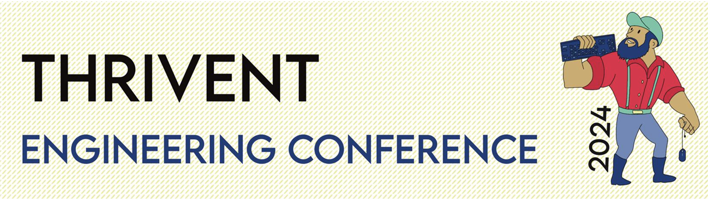

# Wednesday, November 2024

<table>
    <tr>
        <td width="150px">8:00 - 9:00 am</td>
        <td width="600px" align="center">Breakfast (C2)</td>
    </tr>
    <tr>
        <td width="150px">9:00 - 10:00 am</td>
        <td width="600px" align="center"><i>Navigating the Future: A Look Through the Windshield</i>  Jason Walker   (C2)
        </td>
    </tr>
    <tr>
        <td width="150px">10:00 - 10:15 am</td>
        <td width="600px" align="center">Break</td>
    </tr>
    <tr>
        <td width="150px">10:15 - 11:00 am</td>
        <td width="300px" align="center"><i>Racing in the Clouds - A Platform Approach to Winning</i> Jake Lundberg, Hashicorp (C2)</td>
        <td width="300px" align="center"><i>Introduction to Amazon Cloud: Core Services, Well Architected Framework and Financial Services Use Cases</i> Han Tran, AWS (A1 0103)</td>
    </tr>
    <tr>
        <td width="150px">11:00-11:15am</td>
        <td width="600px" align="center">Break</td>
    </tr>
    <tr>
        <td width="150px">11:15-12:45pm</td>
        <td width="600px" align="center">Ignites (C2) Connect and Collaborate Lunch (Cafeteria)</td>
    </tr>
    <tr>
        <td width="150px">12:45-1:15pm</td>
        <td width="600px" align="center">Panel Discussion (C2) 
        Jason Walker, Greg Jacobs, Kim Erickson, Andrew Kolb, Jeff Relien, Reid Knuttila</td>
    </tr>
    <tr>
        <td width="150px">1:15-1:30pm</td>
        <td width="600px" align="center">Break</td>
    </tr>
    <tr><td></td></tr>
    <tr>
        <td width="150px"></td>
<td width="150px" align="center" bgcolor="#ADD8E6" style="color:black;"><b>Track 1: Product Transformation</b> (BO A1 0103 Assembly)</td>
        <td width="150px" align="center" bgcolor="#90EE90" style="color:black;"><b>Track 2: Developer Experience</b> (BO A1 0110 Assembly)</td>
        <td width="150px" align="center" bgcolor="#FFCCCB" style="color:black;"><b>Track 3: Technology</b> (BO B2 2909 Assembly)</td>
        <td width="150px" align="center" bgcolor="#FFFFE0" style="color:black;"><b>Track 4: Party Mix…</b> (BO B2 1815 Conference)</td>
    </tr>
    <tr>
        <td width="150px">1:30-2:15pm</td>
        <td width="150px" align="center"><i>Enterprise Corporate Technology (ECT) DevSecOps Shared Services Lindsay Maddox and Goran Micanovic</td>
        <td width="150px" align="center"><i>Code Liberation: Empowering Salesforce with DevOps Strategies Mike Schirger</td>
        <td width="150px" align="center"><i>Red Hat OpenShift & Kubernetes</i> Melissa Reinke</td>
        <td width="150px" align="center"><i>Understanding Neurodivergence: A Superpower</i> Katrina Somsel</td> 
    </tr>
    <tr>
        <td width="150px">2:15-2:30pm</td>
        <td width="600px" align="center">Break</td>
    </tr>
    <tr>
        <td width="150px">2:30-3:15pm</td>
        <td width="150px" align="center"><i>Be a DORA Explorer</i> Greg Jacobs</td>
        <td width="150px" align="center"><i>Continuing the DevOps Journey – Ephemeral Environments</i> Preston Hardy</td>
        <td width="150px" align="center"><i>Building Intelligent Apps: AWS BedRock & RAG in Action</i>Arunachalam Sankaran</td>
        <td width="150px" align="center"><i>Application Accessibility</i> Tim Lim</td>
    </tr>
    <tr>
        <td width="150px">3:15-3:30pm</td>
        <td width="600px" align="center">Break</td>
    </tr>
    <tr>
        <td width="150px">3:30-4:15pm    
        <td width="150px" align="center"><i>Asset Health through Observability Golden Signals</i> Jamie Peschel</td> 
        <td width="150px" align="center"><i>Storming the Gates: Approaches to Using Gates to Accelerate Releases</i> Paul Lee and Ben Spain</td>
        <td width="150px" align="center"><i>Unlocking the Front End: A Java Developer’s Guide to Vaadin</i> David Ehley</td>
        <td width="150px" align="center"><i>Mutants, Mania, and Mischief: Introduction to Mutation Testing for Developers, Dieticians, and Dentists</i> Greg Mumm</td>
    </tr>
    <tr>
        <td width="150px">4:15-6pm</td>
        <td width="600px" align="center">Happy Hour (Cafeteria)</td>
    </tr>
</table>
